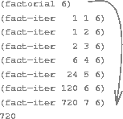
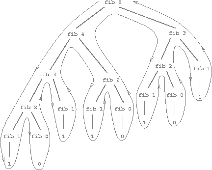

### Linear Recursion and Iteration

<a name="figure-3"></a>


**Figure 1.3**:  A linear recursive process for computing $$6!$$.

We begin by considering the factorial function, defined by

$$
\begin{align}
n!=n\ (n-1)\ (n-2)\cdots3\cdot2\cdot1
\end{align}
$$

There are many ways to compute factorials. One way is to make use of the observation that $$n!$$ is equal to $$n$$ times $$(n - 1)!$$ for any positive integer $$n$$:

$$
\begin{align}
n!=\left[n\ (n-1)\ (n-2)\cdots3\cdot2\cdot1\right] = n\ (n-1)!
\end{align}
$$

Thus, we can compute $$n!$$ by computing $$(n - 1)!$$ and multiplying the result by $$n$$. If we add the stipulation that $$1!$$ is equal to 1, this observation translates directly into a function:

```lisp
(defun factorial (n)
  (if (== n 1)
      1
      (* n (factorial (- n 1)))))
```

We can use the substitution model of section [10.2.5](the-substitution-model-for-function-application.html) to watch this procedure in action computing $$6!$$, as shown in [figure 1.3](#figure-3).

Now let's take a different perspective on computing factorials. We could describe a rule for computing $$n!$$ by specifying that we first multiply 1 by 2, then multiply the result by 3, then by 4, and so on until we reach n. More formally, we maintain a running product, together with a counter that counts from 1 up to $$n$$. We can describe the computation by saying that the counter and the product simultaneously change from one step to the next according to the rule

product $$\gets$$ counter $$\cdot$$ product

counter $$\gets$$ counter $$+ 1$$

and stipulating that $$n!$$ is the value of the product when the counter exceeds $$n$$.

<a name="figure-4"></a>


**Figure 1.4**:  A linear iterative process for computing $$6!$$.

Once again, we can recast our description as a procedure for computing factorials:

```lisp
(defun factorial (n)
  (factorial 1 1 n))

(defun factorial (product counter max-count)
  (if (> counter max-count)
      product
      (factorial (* counter product)
                 (+ counter 1)
                 max-count)))
```

As before, we can use the substitution model to visualize the process of computing 6!, as shown in [figure 1.4](#figure-4).

----

[^1]: 


