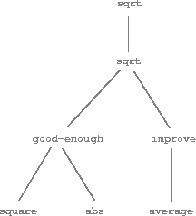

### Procedures as Black-Box Abstractions

``sqrt/1`` is our first example of a process defined by a set of mutually defined procedures. Notice that the definition of ``sqrt/2`` is recursive; that is, the procedure is defined in terms of itself. The idea of being able to define a procedure in terms of itself may be disturbing; it may seem unclear how such a "circular" definition could make sense at all, much less specify a well-defined process to be carried out by a computer. This will be addressed more carefully in section 9.3. But first let's consider some other important points illustrated by the ``sqrt`` example.

Observe that the problem of computing square roots breaks up naturally into a number of subproblems: how to tell whether a guess is good enough, how to improve a guess, and so on. Each of these tasks is accomplished by a separate procedure. The entire ``sqrt`` program can be viewed as a cluster of procedures (shown in [figure 1.2](#figure-2)) that mirrors the decomposition of the problem into subproblems.

**Figure 1.2**:  Procedural decomposition of the ``sqrt`` program.

The importance of this decomposition strategy is not simply that one is dividing the program into parts. After all, we could take any large program and divide it into parts -- the first ten lines, the next ten lines, the next ten lines, and so on. Rather, it is crucial that each procedure accomplishes an identifiable task that can be used as a module in defining other procedures. For example, when we define the ``good-enough?/`` procedure in terms of square, we are able to regard the square procedure as a ``black box.'' We are not at that moment concerned with how the procedure computes its result, only with the fact that it computes the square. The details of how the square is computed can be suppressed, to be considered at a later time. Indeed, as far as the good-enough? procedure is concerned, square is not quite a procedure but rather an abstraction of a procedure, a so-called procedural abstraction. At this level of abstraction, any procedure that computes the square is equally good.
