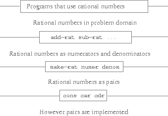

### Abstraction Barriers

Before continuing with more examples of compound data and data abstraction, let us consider some of the issues raised by the rational-number example. We defined the rational-number operations in terms of a constructor ``make-rat/2`` and selectors ``numer/1`` and ``denom/1``. In general, the underlying idea of data abstraction is to identify for each type of data object a basic set of operations in terms of which all manipulations of data objects of that type will be expressed, and then to use only those operations in manipulating the data.

We can envision the structure of the rational-number system as shown in the figure below. The horizontal lines represent *abstraction barriers* that isolate different "levels" of the system. At each level, the barrier separates the programs (above) that use the data abstraction from the programs (below) that implement the data abstraction. Programs that use rational numbers manipulate them solely in terms of the functions supplied "for public use" by the rational-number package: ``add-rat/2``, ``sub-rat/2``, ``mul-rat/2``, ``div-rat/2``, and ``equal-rat?/2``. These, in turn, are implemented solely in terms of the constructor and selectors ``make-rat/2``, ``numer/1``, and ``denom/1``, which themselves are implemented in terms of pairs. The details of how pairs are implemented are irrelevant to the rest of the rational-number package so long as pairs can be manipulated by the use of ``cons/2``, ``car/1``, and ``cdr/1``. In effect, functions at each level are the interfaces that define the abstraction barriers and connect the different levels.

<a name="figure-1"></a>



**Figure 2.1**: Data-abstraction barriers in the rational-number package.

This simple idea has many advantages. One advantage is that it makes programs much easier to maintain and to modify. Any complex data structure can be represented in a variety of ways with the primitive data structures provided by a programming language. Of course, the choice of representation influences the programs that operate on it; thus, if the representation were to be changed at some later time, all such programs might have to be modified accordingly. This task could be time-consuming and expensive in the case of large programs unless the dependence on the representation were to be confined by design to a very few program modules.

For example, an alternate way to address the problem of reducing rational numbers to lowest terms is to perform the reduction whenever we access the parts of a rational number, rather than when we construct it. This leads to different constructor and selector functions:

```lisp
(defun make-rat (n d)
  (cons n d))

(defun numer (x)
  (let ((g (gcd (car x) (cdr x))))
    (trunc (/ (car x) g))))

(defun denom (x)
  (let ((g (gcd (car x) (cdr x))))
    (trunc (/ (cdr x) g))))
```

The difference between this implementation and the previous one lies in when we compute the ``gcd/2``. If in our typical use of rational numbers we access the numerators and denominators of the same rational numbers many times, it would be preferable to compute ``gcd/2`` when the rational numbers are constructed. If not, we may be better off waiting until access time to compute ``gcd/2``. In any case, when we change from one representation to the other, the functions ``add-rat/2``, ``sub-rat/2``, and so on do not have to be modified at all.

Constraining the dependence on the representation to a few interface functions helps us design programs as well as modify them, because it allows us to maintain the flexibility to consider alternate implementations. To continue with our simple example, suppose we are designing a rational-number package and we can't decide initially whether to perform the gcd at construction time or at selection time. The data-abstraction methodology gives us a way to defer that decision without losing the ability to make progress on the rest of the system.
