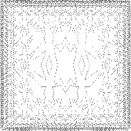

### Example: A Picture Language

This section presents a simple language for drawing pictures that illustrates the power of data abstraction and closure, and also exploits higher-order procedures in an essential way. The language is designed to make it easy to experiment with patterns such as the ones in figure 2.9, which are composed of repeated elements that are shifted and scaled.[^1] In this language, the data objects being combined are represented as procedures rather than as list structure. Just as ``cons``, which satisfies the closure property, allowed us to easily build arbitrarily complicated list structure, the operations in this language, which also satisfy the closure property, allow us to easily build arbitrarily complicated patterns.

**Figure 2.9**:  Designs generated with the picture language.

----

[^1]: The picture language is based on the language Peter Henderson created to construct images like M.C. Escher's "Square Limit" woodcut (see Henderson 1982). The woodcut incorporates a repeated scaled pattern, similar to the arrangements drawn using the ``square-limit`` function in this section.

