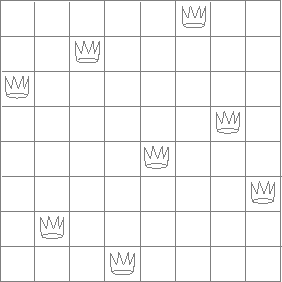

### Exercises

#### Exercise 2.40

Define a function ``unique-pairs`` that, given an integer $$n$$, generates the sequence of pairs $$(i,j)$$ with $$1 \le j \lt i \le n$$. Use ``unique-pairs`` to simplify the definition of ``prime-sum-pairs`` given in the previous section.

#### Exercise 2.41

Write a function to find all ordered triples of distinct positive integers $$i$$, $$j$$, and $$k$$ less than or equal to a given integer $$n$$ that sum to a given integer $$s$$.

#### Exercise 2.42

<a name="figure-2-8"></a>


**Figure 2.8**:  A solution to the eight-queens puzzle.

The "eight-queens puzzle" asks how to place eight queens on a chessboard so that no queen is in check from any other (i.e., no two queens are in the same row, column, or diagonal). One possible solution is shown in figure 2.8. One way to solve the puzzle is to work across the board, placing a queen in each column. Once we have placed $$k - 1$$ queens, we must place the $$k$$th queen in a position where it does not check any of the queens already on the board. We can formulate this approach recursively: Assume that we have already generated the sequence of all possible ways to place $$k - 1$$ queens in the first $$k - 1$$ columns of the board. For each of these ways, generate an extended set of positions by placing a queen in each row of the $$k$$th column. Now filter these, keeping only the positions for which the queen in the $$k$$th column is safe with respect to the other queens. This produces the sequence of all ways to place $$k$$ queens in the first $$k$$ columns. By continuing this process, we will produce not only one solution, but all solutions to the puzzle.

We implement this solution as a function ``queens/1``, which returns a sequence of all solutions to the problem of placing $$n$$ queens on an $$n \times n$$ chessboard. ``queen/1``s another function, ``queen-cols/1``, that returns the sequence of all ways to place queens in the first $$k$$ columns of the board.

```lisp
(defun queens (board-size)
  (queen-cols board-size))
  
(defun queen-cols (k)
  (if (== k 0)
      (empty-board)
      (lists:filter
        (lambda (positions) (safe? k positions))
        (flatmap
          (lambda (rest-of-queens)
            (lists:map (lambda (new-row)
                         (adjoin-position new-row k rest-of-queens))
                       (enumerate-interval 1 board-size)))
          (queen-cols (- k 1))))))
```

In this function ``rest-of-queens`` is a way to place $$k - 1$$ queens in the first $$k - 1$$ columns, and ``new-row`` is a proposed row in which to place the queen for the $$k$$th column. Complete the program by implementing the representation for sets of board positions, including the procedure ``adjoin-position``, which adjoins a new row-column position to a set of positions, and ``empty-board``, which represents an empty set of positions. You must also write the procedure ``safe?/2``, which determines for a set of positions, whether the queen in the kth column is safe with respect to the others. (Note that we need only check whether the new queen is safe -- the other queens are already guaranteed safe with respect to each other.)


#### Exercise 2.43

Louis Reasoner is having a terrible time doing exercise 2.42. His ``queens/1`` function seems to work, but it runs extremely slowly. (Louis never does manage to wait long enough for it to solve even the 6× 6 case.) When Louis asks Eva Lu Ator for help, she points out that he has interchanged the order of the nested mappings in the ``flatmap``, writing it as


```lisp
(flatmap
 (lambda (new-row)
   (lists:map (lambda (rest-of-queens)
                (adjoin-position new-row k rest-of-queens))
              (queen-cols (- k 1))))
 (enumerate-interval 1 board-size))
```

Explain why this interchange makes the program run slowly. Estimate how long it will take Louis's program to solve the eight-queens puzzle, assuming that the program in exercise 2.42 solves the puzzle in time $$T$$.