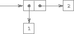

## Hierarchical Data and the Closure Property

As we have seen, pairs provide a primitive "glue" that we can use to construct compound data objects. [Figure 2.2](#figure-2) shows a standard way to visualize a pair -- in this case, the pair formed by ``(cons 1 2)``. In this representation, which is called *box-and-pointer notation*, each object is shown as a *pointer* to a box. The box for a primitive object contains a representation of the object. For example, the box for a number contains a numeral. The box for a pair is actually a double box, the left part containing (a pointer to) the ``car`` of the pair and the right part containing the ``cdr``.

We have already seen that ``cons`` can be used to combine not only numbers but pairs as well. (You made use of this fact, or should have, in doing exercises 2.2 and 2.3.) As a consequence, pairs provide a universal building block from which we can construct all sorts of data structures. [Figure 2.3](#figure-3) shows two ways to use pairs to combine the numbers 1, 2, 3, and 4.

**Figure 2.2**:  Box-and-pointer representation of (cons 1 2).

**Figure 2.3**:  Two ways to combine 1, 2, 3, and 4 using pairs.

The ability to create pairs whose elements are pairs is the essence of list structure's importance as a representational tool. We refer to this ability as the *closure property* of ``cons``. In general, an operation for combining data objects satisfies the closure property if the results of combining things with that operation can themselves be combined using the same operation.[^1] Closure is the key to power in any means of combination because it permits us to create *hierarchical* structures -- structures made up of parts, which themselves are made up of parts, and so on.

From the outset of chapter 1, we've made essential use of closure in dealing with procedures, because all but the very simplest programs rely on the fact that the elements of a combination can themselves be combinations. In this section, we take up the consequences of closure for compound data. We describe some conventional techniques for using pairs to represent sequences and trees, and we exhibit a graphics language that illustrates closure in a vivid way.[^2]

----

[^1]: The use of the word "closure" here comes from abstract algebra, where a set of elements is said to be closed under an operation if applying the operation to elements in the set produces an element that is again an element of the set. The Lisp community also (unfortunately) uses the word "closure" to describe a totally unrelated concept: A closure is an implementation technique for representing procedures with free variables. We do not use the word "closure" in this second sense in this book.

[^2]: The notion that a means of combination should satisfy closure is a straightforward idea. Unfortunately, the data combiners provided in many popular programming languages do not satisfy closure, or make closure cumbersome to exploit. In Fortran or Basic, one typically combines data elements by assembling them into arrays -- but one cannot form arrays whose elements are themselves arrays. Pascal and C admit structures whose elements are structures. However, this requires that the programmer manipulate pointers explicitly, and adhere to the restriction that each field of a structure can contain only elements of a prespecified form. Unlike Lisp with its pairs, these languages have no built-in general-purpose glue that makes it easy to manipulate compound data in a uniform way. This limitation lies behind Alan Perlis's comment in his foreword to this book: "In Pascal the plethora of declarable data structures induces a specialization within functions that inhibits and penalizes casual cooperation. It is better to have 100 functions operate on one data structure than to have 10 functions operate on 10 data structures."

