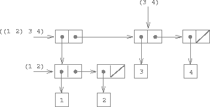
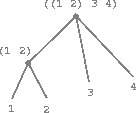

### Hierarchical Structures

The representation of sequences in terms of lists generalizes naturally to represent sequences whose elements may themselves be sequences. For example, we can regard the object ``((1 2) 3 4)`` constructed by

```lisp
(cons (list 1 2) (list 3 4))
```
as a list of three items, the first of which is itself a list, ``(1 2)``. Indeed, this is suggested by the form in which the result is printed by the interpreter. The figure below shows the representation of this structure in terms of pairs.

<a name="figure-5"></a>



**Figure 2.5**: Structure formed by ``(cons (list 1 2) (list 3 4))``.

Another way to think of sequences whose elements are sequences is as *trees*. The elements of the sequence are the branches of the tree, and elements that are themselves sequences are subtrees. Figure 2.6 shows the structure in figure 2.5 viewed as a tree.

<a name="figure-6"></a>



**Figure 2.6**: The list structure in figure 2.5 viewed as a tree.

Recursion is a natural tool for dealing with tree structures, since we can
often reduce operations on trees to operations on their branches, which reduce
in turn to operations on the branches of the branches, and so on, until we
reach the leaves of the tree. As an example, compare the ``len/1`` function of
the section [Representing Sequences]() with the ``count-leaves/1`` function, which returns the total number of leaves of a tree:

```lisp
> (set x (cons (list 1 2) (list 3 4)))
((1 2) 3 4)
> (len x)
3
> (count-leaves x)
4
> (list x x)
(((1 2) 3 4) ((1 2) 3 4))
> (len (list x x))
2
> (count-leaves (list x x))
8
```

To implement ``count-leaves/1``, recall the recursive plan for computing ``len/1``:

* ``len/1`` of a list ``x`` is 1 plus ``len/1`` of the ``cdr`` of ``x``.
* ``len/1`` of the empty list is 0.

``count-leaves/1`` is similar. The value for the empty list is the same:

* ``count-leaves/1`` of the empty list is 0.

But in the reduction step, where we strip off the car of the list, we must take into account that the car may itself be a tree whose leaves we need to count. Thus, the appropriate reduction step is

* ``count-leaves/1`` of a tree ``x`` is ``count-leaves/1`` of the ``car`` of ``x`` plus ``count-leaves/1`` of the ``cdr`` of ``x``.

Finally, by taking ``car``s we reach actual leaves, so we need another base case:

* ``count-leaves/1`` of a leaf is 1.

Here is the complete function:

```lisp
(defun count-leaves
  (('()) 0)
  (((cons head tail))
    (+ (count-leaves head)
       (count-leaves tail)))
  ((_) 1))
```

Once again we use pattern matching in the function arguments. In particular, note when the ``cons`` pattern fails to match on a single element, the final and default pattern succeeds, returning the count for a leaf.
