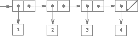

### Representing Sequences

<a name="figure-4"></a>



**Figure 2.4**: The sequence 1, 2, 3, 4 represented as a chain of pairs.

One of the useful structures we can build with pairs is a *sequence* -- an ordered collection of data objects. There are, of course, many ways to represent sequences in terms of pairs. One particularly straightforward representation is illustrated in the figure above, where the sequence 1, 2, 3, 4 is represented as a chain of pairs. The ``car`` of each pair is the corresponding item in the chain, and the ``cdr`` of the pair is the next pair in the chain. The ``cdr`` of the final pair signals the end of the sequence by pointing to a distinguished value that is not a pair, represented in box-and-pointer diagrams as a diagonal line and in programs as the value of the empty list.[^1] The entire sequence is constructed by nested ``cons`` operations:

```lisp
(cons 1 (cons 2 (cons 3 (cons 4 '()))))
```

Such a sequence of pairs, formed by nested ``cons``es, is called a *list*, and Scheme provides a primitive called list to help in constructing lists.[^2] The above sequence could be produced by ``(list 1 2 3 4)``. In general,

```lisp
(list <a1> <a2> ... <an>)
```

is equivalent to

```lisp
(cons <a1> (cons <a2> (cons ... (cons <an> '()) ... ))
```

Lisp systems conventionally print lists by printing the sequence of elements, enclosed in parentheses. Thus, the data object in figure 2.4 is printed as ``(1 2 3 4)``:

```lisp
> (set one-through-four (list 1 2 3 4))
(1 2 3 4)
```

Be careful not to confuse the expression ``(list 1 2 3 4)`` with the list ``(1 2 3 4)``, which is the result obtained when the expression is evaluated. Attempting to evaluate the expression ``(1 2 3 4)`` will signal an error when the interpreter tries to apply the procedure ``1/3`` to arguments ``2``, ``3``, and ``4``.

We can think of ``car`` as selecting the first item in the list, and of ``cdr`` as selecting the sublist consisting of all but the first item. Nested applications of ``car`` and ``cdr`` can be used to extract the second, third, and subsequent items in the list.[^3] The constructor ``cons`` makes a list like the original one, but with an additional item at the beginning.

```lisp
> (car one-through-four)
1
> (cdr one-through-four)
(2 3 4)
> (car (cdr one-through-four))
2
> (cons 10 one-through-four)
(10 1 2 3 4)
> (cons 5 one-through-four)
(5 1 2 3 4)
```

#### List Operations

The use of pairs to represent sequences of elements as lists is accompanied by conventional programming techniques for manipulating lists by successively "``cdr``ing down" the lists. For example, the procedure ``list-ref/2`` takes as arguments a list and a number $$n$$ and returns the $$n$$th item of the list. In Erlang, and thus LFE, is customary to number the elements of the list beginning with 1. The method for computing ``list-ref/2`` is the following: [^4]

* For $$n = 1$$, ``list-ref/2`` should return the ``car`` of the list.
* Otherwise, ``list-ref/2`` should return the $$n$$th item of the ``cdr`` of the list.

```lisp
(defun list-ref (items n)
  (if (== n 1)
      (car items)
      (list-ref (cdr items) (- n 1))))
```
```lisp
> (set squares (list 1 4 9 16 25))
(1 4 9 16 25)
> (list-ref squares 4)
16
```

Often we "``cdr`` down" the whole list. The procedure ``len/1``,[^5] which returns the number of items in a list, illustrates this typical pattern of use:

```lisp
(defun len
  (('())
   0)
  ((items)
   (+ 1 (len (cdr items)))))
```
```lisp
> (set odds (list 1 3 5 7))
(1 3 5 7)
> (len odds)
4
```

The ``len/1`` procedure implements a simple recursive plan. The reduction step is:

* The length of any list is 1 plus the length of the ``cdr`` of the list.

This is applied successively until we reach the base case:

* The passed list matches the pattern of the empty list.

We could also compute length in an iterative style:

```lisp
(defun len (items)
  (len items 0))

(defun len
  (('() count)
   count)
  ((a count)
   (len (cdr a) (+ 1 count))))
```

Another conventional programming technique is to "``cons`` up" an answer list while ``cdr``ing down a list, as in the procedure ``append/2``, which takes two lists as arguments and combines their elements to make a new list:

```lisp
> (append squares odds)
(1 4 9 16 25 1 3 5 7)
> (append odds squares)
(1 3 5 7 1 4 9 16 25)
```

``append/2`` is also implemented using a recursive plan. To append lists ``list1`` and ``list2``, do the following:

* If ``list1`` is the empty list, then the result is just ``list2``.
* Otherwise, append the ``cdr`` of ``list1`` and ``list2``, and ``cons`` the ``car`` of ``list1`` onto the result:

```lisp
(defun append
  (('() list2)
   list2)
  ((list1 list2)
   (cons (car list1) (append (cdr list1) list2))))
```

----

[^1]: The empty list will be discussed more in the section [Symbolic Data]() when we cover the topic of quoting.

[^2]: In this book, we use *list* to mean a chain of pairs terminated by the end-of-list marker. In contrast, the term *list structure* refers to any data structure made out of pairs, not just to lists.

[^3]: Since nested applications of ``car`` and ``cdr`` are cumbersome to write, Lisp dialects provide abbreviations for them -- for instance, ``(cadr <arg>)`` is equivalent to ``(car (cdr <arg>))``. The names of all such procedures start with ``c`` and end with ``r``. Each ``a`` between them stands for a ``car`` operation and each ``d`` for a ``cdr`` operation, to be applied in the same order in which they appear in the name. The names ``car`` and ``cdr`` persist because simple combinations like cadr are pronounceable.

[^4]: This function is provided for pedagogical purposes and that one should usually rely upon the function from the Erlang ``lists`` module: ``(lists:nth 4 squares)``.

[^5]: One should normally not define one's own ``len/1`` function, but instead use the built-in ``erlang:length/1`` function which is also available as simply ``length/1``.
