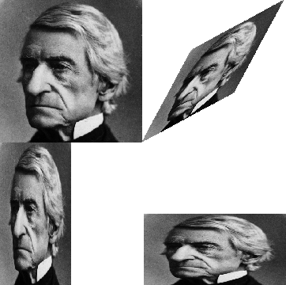

#### The picture language

When we began our study of programming in the section [The Elements of Programming](), we emphasized the importance of describing a language by focusing on the language's primitives, its means of combination, and its means of abstraction. We'll follow that framework here.

Part of the elegance of this picture language is that there is only one kind of element, called a painter. A painter draws an image that is shifted and scaled to fit within a designated parallelogram-shaped frame. For example, there's a primitive painter we'll call wave that makes a crude line drawing, as shown in figure 2.10. The actual shape of the drawing depends on the frame -- all four images in figure 2.10 are produced by the same wave painter, but with respect to four different frames. Painters can be more elaborate than this: The primitive painter called rogers paints a picture of MIT's founder, William Barton Rogers, as shown in figure 2.11. [^1] The four images in figure 2.11 are drawn with respect to the same four frames as the ``wave`` images in figure 2.10.

To combine images, we use various operations that construct new painters from given painters. For example, the beside operation takes two painters and produces a new, compound painter that draws the first painter's image in the left half of the frame and the second painter's image in the right half of the frame. Similarly, below takes two painters and produces a compound painter that draws the first painter's image below the second painter's image. Some operations transform a single painter to produce a new painter. For example, flip-vert takes a painter and produces a painter that draws its image upside-down, and flip-horiz produces a painter that draws the original painter's image left-to-right reversed.

<a name="figure-2-10"></a>


**Figure 2.10**:  Images produced by the wave painter, with respect to four different frames. The frames, shown with dotted lines, are not part of the images.

<a name="figure-2-11"></a>


**Figure 2.11**:  Images of William Barton Rogers, founder and first president of MIT, painted with respect to the same four frames as in figure 2.10 (original image reprinted with the permission of the MIT Museum).

Figure 2.12 shows the drawing of a painter called ``wave4`` that is built up in two stages starting from ``wave``:

<a name="figure-2-12"></a>

```lisp
(defun wave2 (beside wave (flip-vert wave)))
(defun wave4 (below wave2 wave2))
```


```lisp
(defun wave2 (beside wave (flip-vert wave)))
(defun wave4 (below wave2 wave2))
```

**Figure 2.12**: Creating a complex figure, starting from the wave painter of figure 2.10.

In building up a complex image in this manner we are exploiting the fact that painters are closed under the language's means of combination. The beside or below of two painters is itself a painter; therefore, we can use it as an element in making more complex painters. As with building up list structure using cons, the closure of our data under the means of combination is crucial to the ability to create complex structures while using only a few operations.

----

[^1]: William Barton Rogers (1804-1882) was the founder and first president of MIT. A geologist and talented teacher, he taught at William and Mary College and at the University of Virginia. In 1859 he moved to Boston, where he had more time for research, worked on a plan for establishing a "polytechnic institute," and served as Massachusetts's first State Inspector of Gas Meters. When MIT was established in 1861, Rogers was elected its first president. Rogers espoused an ideal of "useful learning" that was different from the university education of the time, with its overemphasis on the classics, which, as he wrote, "stand in the way of the broader, higher and more practical instruction and discipline of the natural and social sciences." This education was likewise to be different from narrow trade-school education. In Rogers's words: "The world-enforced distinction between the practical and the scientific worker is utterly futile, and the whole experience of modern times has demonstrated its utter worthlessness." Rogers served as president of MIT until 1870, when he resigned due to ill health. In 1878 the second president of MIT, John Runkle, resigned under the pressure of a financial crisis brought on by the Panic of 1873 and strain of fighting off attempts by Harvard to take over MIT. Rogers returned to hold the office of president until 1881. Rogers collapsed and died while addressing MIT's graduating class at the commencement exercises of 1882. Runkle quoted Rogers's last words in a memorial address delivered that same year: "As I stand here today and see what the Institute is, ... I call to mind the beginnings of science. I remember one hundred and fifty years ago Stephen Hales published a pamphlet on the subject of illuminating gas, in which he stated that his researches had demonstrated that 128 grains of bituminous coal -- " "Bituminous coal," these were his last words on earth. Here he bent forward, as if consulting some notes on the table before him, then slowly regaining an erect position, threw up his hands, and was translated from the scene of his earthly labors and triumphs to "the tomorrow of death," where the mysteries of life are solved, and the disembodied spirit finds unending satisfaction in contemplating the new and still unfathomable mysteries of the infinite future. In the words of Francis A. Walker (MIT's third president): "All his life he had borne himself most faithfully and heroically, and he died as so good a knight would surely have wished, in harness, at his post, and in the very part and act of public duty."