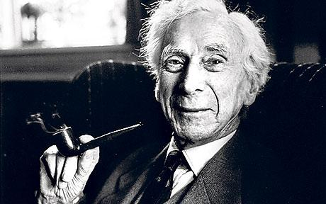
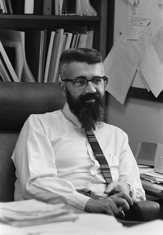

# Preface to the LFE Edition

<blockquote>
Unbound creativity is the power and the weakness of the Force. The Art of Programming Well lies in forging a balance between endless possibilities and strict discipline.
</blockquote>

*--Cristina Videira Lopes, "Jedi Masters", on the history of Lisp and programming*

In the spirit of Alan Perlis' "keeping fun in computing" and Cristina Lopes' entreaty for creativity bounded by the practical, the preface to the LFE edition of this book will cover the following topics:

* A Tale of Lisp Not Often Told
* The Place of Lisp in the 21st Century
* The Interplay of Distributed Systems and Lisps
* Changes from the Second Edition
* Source Code for This Book

## The Origins of Lisp

Beginnings are important. If they don't dictate the trajectory of their antecedants, they certainly have a profound impact on their character. They are also a source of inspiration, in the case of good beinginnings, or shame, in the case of bad ones. The story of Lisp has a good beginning; several of them, in fact.

The history of programming languages hinges upon the principle of computability. This, in turn, ultimately traces its roots to the fundamental concepts of number theory: what are numbers and how to we define them rigorously? These questions were eventually answered in a particularly useful way by the Italian mathematician Giuseppe Peano. Subsequently they were elaborated by successive generations of mathematicians prior to the advent of "high-level" programming languages in the 1950s.

There is a complex lineage of mathematics leading to Lisp. However, for the sake of clarity this is siplified below. The four dominant historical figures discussed provide distinct insights and represent corresponding themes as mathematics evolved unwittingly toward a support for computing. These themes could be summarized as the following:

* Understanding and defining the underpinnings of mathematics itself ("What are numbers? What is counting?")
* Attempting to formally unifiy all of mathematics in a consistent framework of logic ("Can I express all of math in discrete logical assertions and statements?")
* Formally defining algorithms and computability ("Is there a procedure that can take any precise mathematical statement and decide whether the statement is true or false?")
* Creating the means by which symbolic computation and artificial reasoning could be made manifest ("Can we make machines solve problems that are usually considered to require intelligence?")[^1]

Each of these hinged directly upon its predecessor, and the four famous mathematcians listed below embodied these. Exerpts from their lives and work are shared as believed to have impacted the course of events that lead to Lisp's inception.

### Giuseppe Peano

**Figure P.1**: Giuseppe Peano, circa 1910.

Giuseppe Peano was born 100 years before Lisp, in August of 1858. Having graduated from the University of Turin with high honors, he was asked to assist in teaching responsibilities there. Within a few years, he had begun tackling problems in logic and exploring the foundations of the formal philosophy of mathematics. During this time, Peano introduced the world to his now-famous axioms. In particular, the nineth axiom (by modern count, his fifth) is considered the first definition of primitive recursive functions.[^2]

### Bertrand Russell

**Figure P.2**: Bertrand Russell, 1958.

Bertrand Russell was born in 1872 into a family of the British aristocracy. His early life was colored with tragedy: by the time he was six years old, he had lost his mother, sister, father, and grandfather. He was a deeply pensive child naturaly inclined towards philosophical topics, and by 1883 -- at the age of 11 -- he was set upon the path for the first half of his life.

It was at this time that his brother was tutoring him on Euclid's geometry:

"This was one of the great events of my life, as dazzling as first love. I had not imagined that there was anything so delicious in the world. After I had learned the fifth proposition, my brother told me that it was generally considered difficult, but I had found no difficulty whatever. This was the first time it had dawned upon me that I might have some intelligence. From that moment until Whitehead and I finished *Principia* ... mathematics was my chief interest, and my chief source of happiness."[^br1]

Shortly after this Russell shares with his readers that this time also marked his destiny toward *Principia Mathematica*:

"I had been told that Euclid proved things, and was much disappointed that he started with axioms. At first I refused to accept them unless my brother could offer me some reason for doing so, but he said: 'If you don't acept them we cannot go on', and as I wished to go on, I reluctantly admitted them *pro tem*. The doubt as to the premisses of mathematics which I felt at that moment remained with me, and determined the course of my subsequent work."

In 1900, Russell attended the First International Conference of Philosophy where he had been invited to read a paper. In his autobiography, he describes this fateful event:

"The Congress was a turning point in my intellectual life, because I there met Peano. I already knew him by name and had seen some of his work, but had not taken the trouble to master his notation. In discussions at the Congress I observed that he was more precise than anyone else, and that he invariably got the better of any argument upon which he embarked. As the days went by, I decided that this must be owing to his mathematical logic. I therefore got him to give me all his works, and as soon as the Congress was over I retired to Fernhurst to study quietly every word written by him and his disciples. It became clear to me that his notation afforded an instrument of logical analysis such as I had been seeking for years, and that by studying him I was acquiring anew powerful technique for the work that I had long wanted to do. By the end of August I had become completely familiar with all the work of his school. I spent September in extending his methods to the logic of relations. It seemed to mein retrospect that, through that month, every day was warm and sunny. The Whiteheads stayed with us at Fernhurst, and I explained my new ideas to him. Every evening the discussion ended with some difficulty, and every morning I found that the difficulty of the previous evening had solved itself while I slept. The time was one of intellectual intoxication. My sensations resembled those one has after climbing a mountain in a mist when, on reaching the summit, the mist suddenly clears, and the country becomes visible for forty miles in every direction. For years I had been endeavoring to analyse the fundamental notions of mathematics, such as order and cardinal numbers. Suddenly, in the space of a few weeks, I discovered that appeared to be definitive answers to the problems which had baffled me for years. And in the course of discovering these answers, I was introducing a new mathematical technique, by which regions formerly abandoned to the vaguenesses of phliosophers were conquered for the precision of exact formulae. Intellectually, the month of September 1900 was the highest point of my life."[^br2]

Over the course of the next 10 years, Russell and Whitehead collaborated on a work that ultimately inspired Gödel's incompleteness theorems and Church's $$lambda$$-calculus.

### Alonzo Church

**Figure P.3**: Alonzo Church, 1943.

[^ac1]

### John McCarthy

**Figure P.4**: John McCarthy, 1965.

John McCarthy was born in 1927, in the city of Boston. Due to difficulties finding work during the Great Depression, the family moved to New York, then finally settled in Los Angeles. Having establised an early aptitude and proficieny in mathematics, McCarthy skipped two years of math upon his enrollment at Caltech. The year he received his undergraduate degree, he attended the 1948 Hixon Symposium on Cerebral Mechanisms in Behavior. The speakers at the symposium represented an intersection of mathematics, computation, and psychology. They were as follows:

* Professor Ward C. Halstead, University of Chicago
* Professor Heinrich Kluver, University of Chicago
* Professor Wolfgang Kohler , Swarthmore College
* Professor K. S. Lashley, Harvard University
* Dr. R. Lorente de No, Rockefeller Institute for Medical Research
* Professor Warren S. Mc Culloch, University of Illinois
* Dr. John von Neumann, Institute for Advanced Study

John von Neumann presented his paper "The General and Logical Theory of Automata",[^jm1] after which McCarthy became intrigued with the idea of developing machines that could think as people do. McCarthy remained at Caltech for one year of grad school, and then pursed his PhD at Princeton. In discussions with an enthusiastic von Neumann at Princeton, McCarthy shared his ideas about interacting finite automata -- ideas inspired by von Neumann's talk at the Hixon Symposium.

After completing his PhD dissertation, Claude Shannon invited McCarthy and his friend Marvin Minksy to work with him at Bell Labs for the summer. McCarthy and Shannon collaborated on assembling a volume of papers entitled "Automata Studies". McCarthy was dissappointed that so few submissions concerned the topic of machine intelligence. A few years later, he had the opportunity to address this by proposing a summer research project which he and the head of IBM's Information Research pitched to Shannon and Minksy. They agreed, and a year later the now-famous Artificial Intelligence workshop was held in Dartmouth.

It was here, thanks to Allen Newell and Herb Simon, that McCarthy was exposed to the idea of list processing in for a proposed "logical language" (later named IPL). Upon seeing the implementation later, McCarthy was not particularly enthusiastic, due to assemnbly-like style. That, in conjuntion with his inability to gain any traction with the maintainers of FORTRAN for the support of recursion or conditionals, inspired him to create a language that suited his goals of exploring maching intelligence. With the seeds of Lisp sown in 1956, it was two more years before the forming of a special project under the auspices of the MIT Research Laboratory of Electronics: with one room, one secretary, two programmers, a key punch and six grad students, the MIT AI project was founded and Lisp was shortly thereafter born.

### Erlang

Though the LFE edition of *Structure and Interpretation of Computer Programs* is a reworking of the Scheme original to LFE and while both version focus entirely upon Lisp, we would be remiss if a brief history of Erlang -- upon which LFE firmly rests -- was not covered as well. One of the most concise and informative sources of Erlang history is the paper[^er1] that Joe Armstrong wrote for the third History of Programming Languages[^er2] conference. 

What evolved into Erlang started out as the simple task of "solving Ericsson's software problem." [^er3] Practically, this involved a series of initial experiments in programming simple telephon systems in a variety of programming languages. The results of this, namely as follows, fueled the next round of experients:

* Small languages seemed better at succinctly addresssing the problem space.
* The functional programming paradigm was appreciated, if sometimes viewed as awkward.
* Logic programming provided the most elegant solutions in the given problem space.
* Support for concurrency was viewed as essential

Joe Armstrong's first attempts at Erlang were actually done in 1985 using the  Smalltalk programming language. He switched away from this after Roger Skagervall observed that the logic Joe had developed was really just thinly veiled Prolog. The development of a robust systems programming language for telephony was further refined with advice from Mike Williams, already a veteran in programming concurrent systems. He said that for a concurrent programming language to be efficient it had to keep in mind three key things that dominated its problem space: [^er4]

* The time needed to create a process
* The time required to perform a context switch between two processes
* The amount of time taken to copy a message from one process to another

Furthermore, Bjarne Däcker defined the following capabilities for a language to be useful when programming telecommunications switches:

* To handle high-concurrency
* To handle soft real-time
* To support non-local, distributed computing
* To enable hardware interaction
* To support very large scale software systems
* To support complex interactions
* To provide non-stop operationm (on the order of years)
* To allow for system updates without downtime
* To provide high-nines reliability
* To provide fault-tolerance for both hardware and software

With these guiding principles, Erlang in its Prolog form emerged over the course of 1986 and 1987. Robert Virding joined Armstrong in this effort during this time period [^er5] and helping with such tasks as rewriting the initial prototype to improve concurrency performance. 

### LFE

It wasn't until 2007 that, after 20 years of contributions to Erlang, Virding decided to start experimenting with a Lisp running on the Erlang VM. [^lfe0] Initially explored as a Lisp 1, Virding switched to separating the name spaces for functions and variables more like the Lisp 2 of Common Lisp. [^lfe1] LFE currently supports such features as:

* Non-hygenic macros
* Various forms borrowed from Scheme, Maclisp, and Common Lisp
* A REPL which allows for the definition of functions, records, and macros [^lfe2]
* Immutable data
* Pattern matching
* Modules
* Functional programming paradigm
* Erlang data types
* Light-weight language processes
* Hot-loading of code on running systems
* 100% compatibility with Core Erlang and OTP

As to its own origins, on the LFE mail list Virding shared the following as the primary motivating factors:

* He was an "old Lisper" and was therefore quite interested in implementing a Lisp.
* He was curious as to what a Lisp on the Erlang VM would look like and how it would run. (It had always been a goal of his to make a Lisp which was specially designed for running on the Erlang VM and able to fully interact with Erlang/OTP.)
* He wanted to experiment with compiling a language from Core Erlang (adopted by the Erlang compiler in 2001) [^lfe3]
* He was looking for some interesting programming projects that were not too large to do in his spare time.
* He likes implementing languages.
* He also thought it would be a fun problem to solve: it was an open-ended problem with lots of interesting parts.

Once again, the spirit of exploration conspired to bring something new and interesting into the world while at the same time reflecting a rich and varied history. On the one hand, LFE has a Lisp heritage stretching back through the $$\lambda$$-Calculus to Peano. On the other, it is a systems programming language benefiting from Prolog vestiages such as pattern-matching list comprehensions. Hardened through industrial use, it rests upon a VM which powers 40% of the worlds telecommunications traffic. [^lfe4] This is a potentially powerful combination offering unique capabilities the distributed systems metaprogrammer.

## The Place of Lisp in the 21st Century

The ups-and-downs of Lisp since it's inception in 1958 have been covered in various media since the late 1970s. While Lisp continues to have its supporters and detractors, one thing is abundantly clear: many of the characteristics initially touted as making Lisp unique and powerful are now shared by a vast majority of modern programming languages. The inevitable question is then asked: what use is Lisp, more than 50 years after its creation when the world of computing -- both research and industry -- are so vastly different?

The first answer usually given is one that requires very little thought: macros. There are numerous books written on this topic and we will not cover it further here, but accept as a given that the support of Lisp-style macros in any programming language is a powerful tool. Once we get past the obvious answer, subtler answers come to the fore, such as: the simplicty of the syntax and similarity to parenthetically grouped algebra expressions make for an easy programming introduction to children of a middle school age. This simplicity is also something offering great insights to experienced programmers. Alan Kay's famous quote of Lisp being the software equivalent of Maxwell's famous partial differential equations for classical electrodynamics [^lf1] is due to this simplicity, that one can fit the essence of the language in one's head or on a single sheet of paper. [^lfe1.5]

The education point is important: if we cannot teach the profound basics of a science or a branch of mathematics, it has ceased to become a science and should at that point be considered a superstition or cargo cult, with its practictioners perhaps engaged in a great deal of activity or even lucrative commerce, but having no understanding of the principles which form the basis of such a lifestyle. However, to be a compelling point of study, the value of Lisp in the 21st century most hold more than simply the promise of clarity and the means by which one might create domain-specific languages. To be genuinely pertinent, it much reach beyond the past and the present, and hold open undiscovered doors for each new generation of intrepid programmers.

And here the answer arrives, not as some astounding epiphany, but again in humble simplicity: Lisp's fun and its beauty rest not only in its syntactic elegance but in its power of expression. This is speficically important for the adventurer: if you want to create something new, explore some new programmatical territory, you need tools at your fingertips which will allow you to do so flexibly and quickly, with as little overhead as possible. Otherwise the moment is lost and the creative process is swallowed in a mire of heavy infrastructure and process. By putting the power of Lisps into the hands of each generation's aspiring programmers, we are ensuring they have what is necessary to accomplish feats that might seem miraculous to us should we see them now -- as genuinely new ideas often appear (when appreciated). A world that sees the rise of quantum computing or the molecular programming of nano-scale machines or as yet undreampt technological capabilities, will need programmers who have the ability to iterate quickly and try out new ideas, easily able to clearly see that which should be abandoned and that which should be taken up. This is *especially* important for the survival of free software: as long as our socieities are able to produce languages, software, and systems which individuals or small groups may attain understaning and mastery over, software freedom will prevail. Systems that are so complex as to require an industry to manage are no longer in the domain of motivated and curious individuals, but rather only organizations with sufficient capital to maintain the necessary infrastructure. 

Thus, as we point our technological society towards its future with each action we take, as individuals and as a group, we have a responsibility to maintain the tools which will ensure the freedom of future generations, the basic freedom of the tool-maker, the hacker, the artist, and the poet. Lisp is not the only answer to this particular need, but it has shown its strengths in this regard over the past 50 years, and if the last 10 years of re-discovery and innovation in the world of programming is any indication, Lisp is alive and well and will likely be with us for a long time to come.

And there will be even more fun to be had by all.

## Notes on Changes from the Original

The original text of Structure and Interpretation of Computer Programs was
published in the 80s, but has material in it preceding even that time. Though
the essenve of what was taught in that course and with this text remains just
as relevant today, much context has changed in the field of computing since
then.

Furthermore, this edition of SICP is an adaptation for a different programming
language -- through still a Lisp -- whose syntax differs in varying degrees,
but perhaps most significant, is built upon a very different programming
language: Erlang.

As such, we have taken liberties in our edition of SICP, hopefully with little
to no impact on its essence. These liberties include the following:

* The Lisp-2 syntax of LFE is used instead of the Lisp-1 syntax of a Scheme.
* As an extension of that first point, features such as pattern matching in function heads, guards, multi-arity functions, etc., are used extensively, often leading to more concise functions that their original, Scheme counterparts.
* When pertienent, features from LFE and Erlang are introduced in conjunction
  with the subject matter of the original text.
* Very rarely some of the original text or footnotes might be omitted when not at all applicable
  to LFE.
* LFE doesn't support nested ``defun``s like Scheme supports nested ``define``s; ``flet`` and ``flectrec`` are used instead. However, as a result, these are introduced before ``let``. This is awkward, but not diasterous.
* The LFE Edition uses LaTeX, and as such, equations are much easier to read.
* Updating examples to modern, accepted forms (e.g., the Ackermann function).
* Exercises are broken out into their own sections (while preserving their original order and placement in the chapters).

Some of the terminology in the text has also been changed to maintain
consistency with that used by the Erlang and LFE community. Most prominently,
readers of the original text will notice that we do not use the term
"procedure" but have instead opted for the more common term "function".

## Obtaining the Book and Related Code

[note about the original license for SICP and the continuation of that licensing for the LFE edition]

### Book Source

[Forthcoming]

### Code Use in the Book

[Forthcoming]

----

[^1]: An almost word-for-word quote from John McCarthy's January 1962 submisstion in the quarterly progress report for MIT's RLE, titled [XXI. ARTIFICIAL INTELLIGENCE](http://dspace.mit.edu/bitstream/handle/1721.1/53661/RLE_QPR_064_XXI.pdf), page 189 on the original hard copy. The table of contents for the original is available [here](http://dspace.mit.edu/bitstream/handle/1721.1/53645/RLE_QPR_064_TOC.pdf).

[^2]: See Robert I. Soare's 1995 paper entitled "Computability and Recursion", page 5.

[^br1]: The 1998 reissued hardback "Autobiography" of Bertrand Russell, pages 30 and 31. 

[^br2]: Ibid., page 147.

[^ac1]: See the [Introduction](http://www.math.ucla.edu/~hbe/church.pdf) to the Collected Works of Alonzo Church, MIT Press, not yet published.

[^jm1]: A transcript of the talk is vailable in Volume V of John von Neumann "Collected Works". The topics covered were as follows: **1.** Preliminary Considerations; **2.** Discussion of Certain Relevant Traits of Computing Machines; **3.** Comparisons Between Computing Machines And Living Organisms; **4.** The Future Logical Theory of Automata; **5.** Principles of Digitalization; **6.** Formal Neural Networks; and **7.** The Concept of Complication and Self-Reproduction. The talk concluded with an intensive period of question and answer, also recorded in the above-mentioned volume.

[^er1]: See Armstrong's paper [here](http://webcem01.cem.itesm.mx:8005/erlang/cd/downloads/hopl_erlang.pdf).

[^er2]: [HOPL III](http://research.ihost.com/hopl/HOPL-III.html) was held in San Diego, early June of 2007. From the perspective of LFE, it is interesting to note that each language comprising its essence have been covered at HOPL conferences: **1.** HOPL I, 1978 John McCarthy presented "History of Lisp"; **2.** HOPL II, 1993 Guy L. Steele, Jr. and Richard P. Gabriel presented "The Evolution of Lisp," a continuation of McCarthy's 1978 talk; **3.** HOPL III, 2007 Joe Armstrong presented "A History of Erlang."

[^er3]: Armstrong 2007, page 3.

[^er4]: Ibid., page 2.

[^er5]: "Robert Virding and Joe Armstrong - The History of the Erlang Virtual Machine", Erlang Factory 2010, London.

[^lfe0]: Thread on the LFE mail list entitled [LFE History](https://groups.google.com/d/msg/lisp-flavoured-erlang/XA5HeLbQQDk/TUHabZCHXB0J)

[^lfe1]: LFE also distingueshes between functions basd on arity, thus it is regularly jokingly referred to as a Lisp 2+.

[^lfe1.5]: Or, as the case may be, the lower 2/3rd of a page.

[^lfe2]: This is in stark contrast to the Erlang shell which does not allow the developer to define functions (except as anonymous ones assigned to a variable); Erlang also does not have Lisp-style macros.

[^lfe3]: See Carlsson's 2001 paper "An introduction to Core Erlang", page 2.

[^lfe4]: This is something often quoted in Erlang marketing materials; the number is based upon the market share Ericsson has in deployed systems world-wide.

[^lf1]: See the ACM-hosted [interview with Alan Kay](http://queue.acm.org/detail.cfm?id=1039523).
