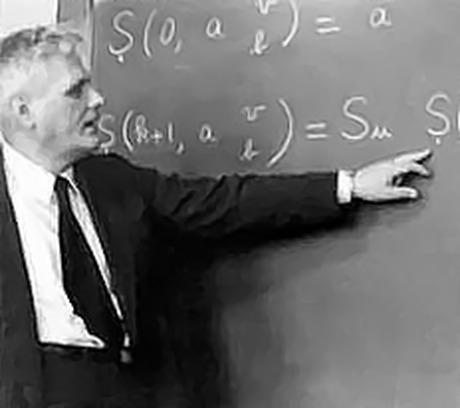

### Alonzo Church

**Figure P.3**: Alonzo Church, 1943.

Alonzo Church was born in Washington, D.C. in 1903.[^1] His great-grandfather (originally from Vermont) was not only a professor of mathematics and astronomy at the University of Georgia, but later become it's president.[^2] Church graduated from a Connecticut prep-school in 1920 and then enrolled in Princeton to study mathematics. He published his first paper as an undergraduate and then continued at Princeton, earning his Ph.D. in just three years.

While a graduate student, Church was hit by a trolley car and spent time in a hospital where he met Julia Kuczinski[^3] -- they were married a year later and remained inspearable until her death, 51 years later. Church had a reputation for being a bit quirky: he never drove a car or typed; he was extremely neat and fastidious; he walked everywhere and often hummed to himself while he did so; he loved reading science fiction magazines;[^4] a nightowl, he often did his best work late at night. Though he had solitary work habits, his list of Ph.D. students is impressive, including the likes of Turing, Kleene, and Rosser.

Perhaps one of Church's more defining characteristics was his drive: he deliberately focusd on prominent problems in mathematics and attacked them with great force of will. A few of the problems he had focused on in the early 30s were:

1. Known paradoxes entailed by Betrend Russell's theory of types [^5]
1. David Hilbert's *Entschiedungsproblem*, and
1. The implications of Gödel's completeness theorem.

These were some of the most compelling challenges in mathematics at that time. All of them ended up meeting at the cross-roads of the $$\lambda$$-calculus.

Church had started working on the $$\lambda$$-calculus when attempting to address the Russell Parardox [^6]. However, it was not that goal toward which the $$\lambda$$-calculus was ultimately applied. Instead, it become useful -- essential, even -- in his efforts to define what he called "calculability" and what is now more commonly referred to as *computability*.[^7] In this the $$\lambda$$-calculus was an unparalleled success, allowing Church to solve the *Entschiedungsproblem* using the concept of recursive functions. Thus was laid the foundation upon which John McCarthy was able to build the first programming language which used the $$\lambda$$-calculus: Lisp.

---

[^1]: The majority of the material for this section has been adapted from the [Introduction](http://www.math.ucla.edu/~hbe/church.pdf) to the Collected Works of Alonzo Church, MIT Press (not yet published).

[^2]: This was when the Univerity of Georgia was still called Franklin College.

[^3]: She was there in training to become a nurse.

[^4]: He would also write letters to the editors when the science fiction writers got their science wrong.

[^5]: These complications were known and discussed by Russell himself at the time of *Principia*'s publication.

[^6]: See [Russell's paradox](http://en.wikipedia.org/wiki/Russell%27s_paradox).

[^7]: "Computability" was the term which Turing used.