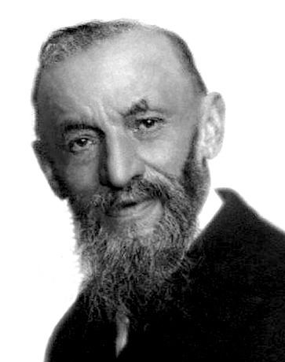

### Giuseppe Peano

**Figure P.1**: Giuseppe Peano, circa 1910.

Giuseppe Peano was born 100 years before Lisp, in August of 1858 at his family's farmhouse in the north of Italy. At a young age he was recognized as having an exceptionally quick mind, and through the favor of an uncle obtained a good early education in Turin, where he not only stayed for university, but for his career as well.

After graduating from the University of Turin with high honors, he was asked to assist in teaching responsibilities there. Within a few years, he had begun tackling problems in logic and exploring the foundations of the formal philosophy of mathematics. During this time, Peano introduced the world to his now-famous axioms.[^1][^2] In particular, the nineth axiom (by modern count, his fifth) is considered the first definition of primitive recursive functions.[^3] In this same work Peano described a function of a variable with explicit recursive substituion.[^4]

Following the publication of his axioms in 1889 through the beginning of the 20th century, Peano was considered one of the leading figures in mathematical logic, alongside Frege and Russell. This was due to Peano's work on and advocacy for a unified formulation of mathematics cast in logic though his work *Formulario Mathematico* which was first published in 1895. Four subsequent editions, each essentially new works in their own right more finely honed the formulas presented and the symbols -- in essence, a syntax -- for the language of logic.

Having co-chaired the track on "Arithmetic and Algebra" and given a keynote on logic at the First International Congress of Mathematicians in Zurich (1897), as well as published multiple editions of the *Formulario*, by the time Peano arrived at the international congresses of both mathematics and philosopy, this time held in Paris, 1900, he was at the peak of his career in general, and the height of his development of mathematical logic in particular. Peano, along with Burali-Forti, Padoa, Pieri, Vailati, and Vacca were said to have been "supreme" and to have "absolutely dominated" the discussions at the conference in the field of the philosphy of sciences.[^5]

Bertrand Russell was present at the congress and was so completely taken with efficacy of Peano's approach to logic that upon receiving from Peano his collected works, he returned home to study them instead of remaining in Paris for the Mathematical Congress. A few months later he wrote to Peano, attaching a manuscript detailing the assessments Russell had been able to make thanks to the thorough study of Peano's works. Peano wrote to him the following March congratulating Russell on "the facility and precision" with which he managed Peano's logical symbols and then published his paper that July. However, this was only the beginning for Russell; the baton had been firmly passed and the advance towards a theory of computation made taken its next step.

----

[^1]: This was in Peano's book of 1889 "Arithmetices principia, nova methodo exposita" (in English, *The principles of arithmetic, presented by a new method*).

[^2]: In addition it was in this same period of time that Peano started creating various logic and set notations that are still in use today.

[^3]: See Robert I. Soare's 1995 paper entitled "Computability and Recursion", page 5.

[^4]: See the 2006 paper "History of Lambda-calculus and Combinatory Logic" by Felice Cardone and J. Roger Hindley, page 2.

[^5]: See page 91 of Hubert C. Kennedy's 1980 hardcover edition of "Peano: Life and Works of Giuseppe Peano", Volume 4 of the "Studies in the History of Modern Science."