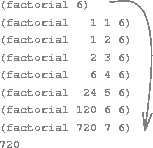

### Linear Recursion and Iteration

<a name="figure-3"></a>


**Figure 1.3**:  A linear recursive process for computing $$6!$$.

We begin by considering the factorial function, defined by

$$
\begin{align}
n!=n\ (n-1)\ (n-2)\cdots3\cdot2\cdot1
\end{align}
$$

There are many ways to compute factorials. One way is to make use of the
observation that $$n!$$ is equal to $$n$$ times $$(n - 1)!$$ for any positive
integer $$n$$:

$$
\begin{align}
n!=\left[n\ (n-1)\ (n-2)\cdots3\cdot2\cdot1\right] = n\ (n-1)!
\end{align}
$$

Thus, we can compute $$n!$$ by computing $$(n - 1)!$$ and multiplying the
result by $$n$$. If we add the stipulation that $$1!$$ is equal to 1, this
observation translates directly into a function:

```lisp
(defun factorial (n)
  (if (== n 1)
      1
      (* n (factorial (- n 1)))))
```

We can use the substitution model of section [The Substitution Model for
Function Application](the-substitution-model-for-function-application.html) to
watch this function in action computing $$6!$$, as shown in [figure
1.3](#figure-3).

Now let's take a different perspective on computing factorials. We could
describe a rule for computing $$n!$$ by specifying that we first multiply 1 by
2, then multiply the result by 3, then by 4, and so on until we reach n. More
formally, we maintain a running product, together with a counter that counts
from 1 up to $$n$$. We can describe the computation by saying that the counter
and the product simultaneously change from one step to the next according to
the rule

product $$\gets$$ counter $$\cdot$$ product

counter $$\gets$$ counter $$+ 1$$

and stipulating that $$n!$$ is the value of the product when the counter
exceeds $$n$$.

<a name="figure-4"></a>


**Figure 1.4**:  A linear iterative process for computing $$6!$$.

Once again, we can recast our description as a function for computing
factorials:

```lisp
(defun factorial (n)
  (factorial 1 1 n))

(defun factorial (product counter max-count)
  (if (> counter max-count)
      product
      (factorial (* counter product)
                 (+ counter 1)
                 max-count)))
```

As before, we can use the substitution model to visualize the process of computing 6!, as shown in [figure 1.4](#figure-4).

Compare the two processes. From one point of view, they seem hardly different at all. Both compute the same mathematical function on the same domain, and each requires a number of steps proportional to $$n$$ to compute $$n!$$. Indeed, both processes even carry out the same sequence of multiplications, obtaining the same sequence of partial products. On the other hand, when we consider the "shapes" of the two processes, we find that they evolve quite differently.

Consider the first process. The substitution model reveals a shape of expansion followed by contraction, indicated by the arrow in [figure 1.3](#figure-3). The expansion occurs as the process builds up a chain of *deferred operations* (in this case, a chain of multiplications). The contraction occurs as the operations are actually performed. This type of process, characterized by a chain of deferred operations, is called a *recursive process*. Carrying out this process requires that the interpreter keep track of the operations to be performed later on. In the computation of $$n!$$, the length of the chain of deferred multiplications, and hence the amount of information needed to keep track of it, grows linearly with $$n$$ (is proportional to $$n$$), just like the number of steps. Such a process is called a *linear recursive process*.

By contrast, the second process does not grow and shrink. At each step, all we need to keep track of, for any n, are the current values of the variables ``product``, ``counter``, and ``max-count``. We call this an *iterative process*. In general, an iterative process is one whose state can be summarized by a fixed number of *state variables*, together with a fixed rule that describes how the state variables should be updated as the process moves from state to state and an (optional) end test that specifies conditions under which the process should terminate. In computing $$n!$$, the number of steps required grows linearly with $$n$$. Such a process is called a *linear iterative process*.

The contrast between the two processes can be seen in another way. In the iterative case, the program variables provide a complete description of the state of the process at any point. If we stopped the computation between steps, all we would need to do to resume the computation is to supply the interpreter with the values of the three program variables. Not so with the recursive process. In this case there is some additional "hidden" information, maintained by the interpreter and not contained in the program variables, which indicates "where the process is" in negotiating the chain of deferred operations. The longer the chain, the more information must be maintained.[^1]

In contrasting iteration and recursion, we must be careful not to confuse the notion of a recursive *process* with the notion of a recursive *function*. When we describe a function as recursive, we are referring to the syntactic fact that the function definition refers (either directly or indirectly) to the function itself. But when we describe a process as following a pattern that is, say, linearly recursive, we are speaking about how the process evolves, not about the syntax of how a function is written. It may seem disturbing that we refer to a recursive function such as ``factorial/3`` as generating an iterative process. However, the process really is iterative: Its state is captured completely by its three state variables, and an interpreter need keep track of only three variables in order to execute the process.

One reason that the distinction between process and function may be confusing is that most implementations of common languages (including Ada, Pascal, and C) are designed in such a way that the interpretation of any recursive function consumes an amount of memory that grows with the number of function calls, even when the process described is, in principle, iterative. As a consequence, these languages can describe iterative processes only by resorting to special-purpose ``looping constructs'' such as do, repeat, until, for, and while. The implementation of Scheme we shall consider in the chapter [Computing with Register Machines]() does not share this defect. [LFE Editor's Note: we need to revisit this note after we have completed writing Chapter 5, in case the facts referred to in this footnote end up being different or otherwise untrue.] It will execute an iterative process in constant space, even if the iterative process is described by a recursive function. An implementation with this property is called tail-recursive. With a tail-recursive implementation, iteration can be expressed using the ordinary function call mechanism, so that special iteration constructs are useful only as syntactic sugar.[^2]

----

[^1]: When we discuss the implementation of functions on register machines in chapter 14, we will see that any iterative process can be realized "in hardware" as a machine that has a fixed set of registers and no auxiliary memory. In contrast, realizing a recursive process requires a machine that uses an auxiliary data structure known as a stack. 

[^2]: Tail recursion has long been known as a compiler optimization trick. A coherent semantic basis for tail recursion was provided by Carl Hewitt (1977), who explained it in terms of the "message-passing" model of computation that we shall discuss in chapter 12. Inspired by this, Gerald Jay Sussman and Guy Lewis Steele Jr. (see Steele 1975) constructed a tail-recursive interpreter for Scheme. Steele later showed how tail recursion is a consequence of the natural way to compile function calls (Steele 1977). The IEEE standard for Scheme requires that Scheme implementations be tail-recursive. Note that LFE also supports tail-recursion ([via Erlang](http://learnyousomeerlang.com/recursion)).


